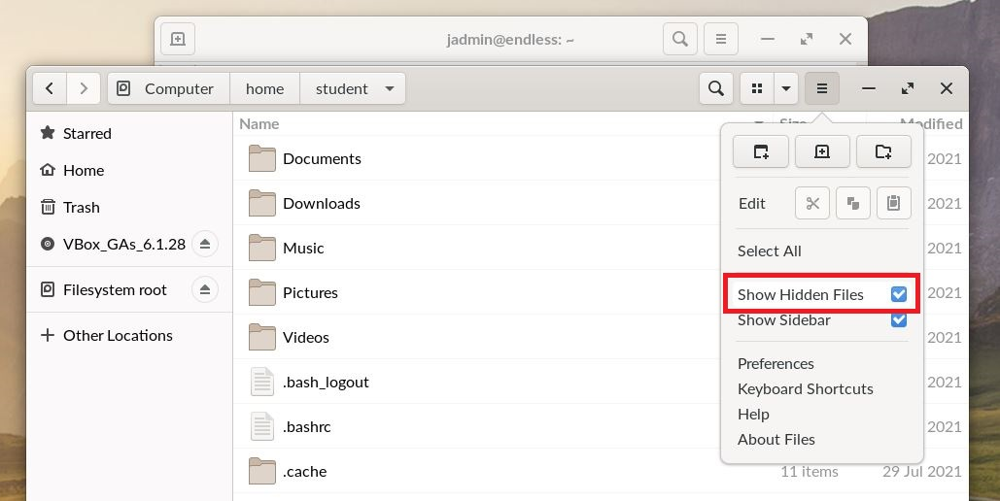

.. _accessing_student_folders:

Accessing Student Folders
#########################

This guide will help you learn how to access student folders while logged in as jadmin

*************
Prerequisites

To accomplish this task, you will need:

* WP Securebook
* jadmin Credentials

To access the student folders, follow these steps:

1. Log into the jadmin account
2. Type "terminal" into the Universal Searchbar at the top of the desktop
3. Select the Terminal Application from the options provideed

4. Enter into the terminal the following command:

.. codeblock:: bash

    sudo nautilus
    
5. From the File Explorer Window that appears, select Filesystem root in the left navigation menu

6. Select the home folder

7. Select the student's folder you wish to access (it should say either their name or student as shown)

From here you can select whatever folders and files you wish to investigate.

.. note::

    To display any hidden files and/or folders, click the three horizontal lines button in the top of the file explorer window and check the box next to "Show Hidden Files"
    
