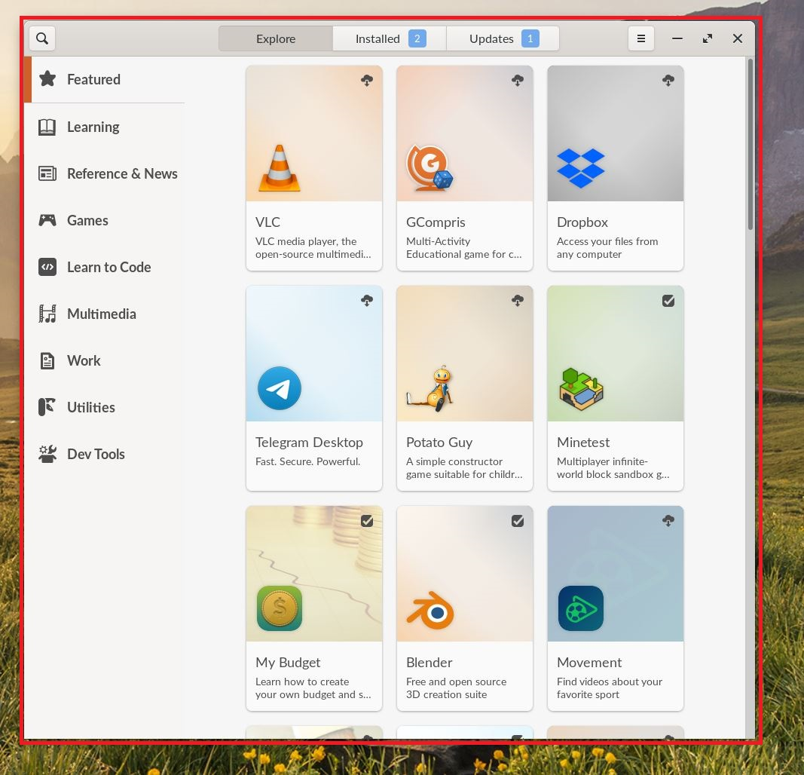
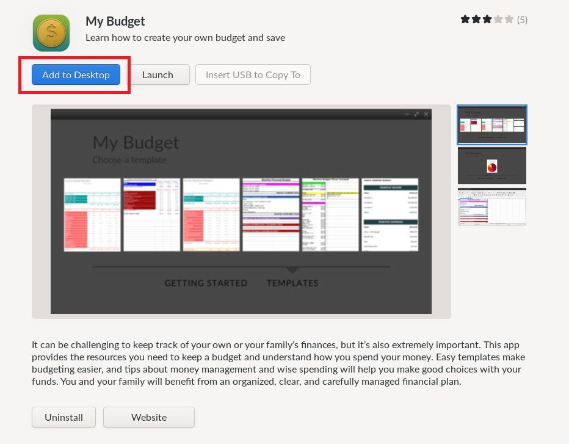

.. _adding_app_desktop_icons:

Adding Application Icons to the Desktop
#######################################

This guide will help you learn how to add app icons to the desktop for ease of use

*************
Prerequisites

To accomplish this task, you will need:

* WP Securebook

To add icons to the desktop, follow these steps:

1. Log into an Endless OS user account
2. Right click on an empty space on the desktop
3. Choose "Add App" from the list of options provided

4. Select the application you want from the App Center

5. Click the "Add to Desktop" button

6. Close the App Center and Check the desktop for your new icon

.. image:: ../_resources/DesktopIcons_newIcon.jpg

.. note::

    Once an Application is added to the desktop, it can also be removed from the same page we added it on in step 5 by clicking the "Remove from Desktop" button
    
