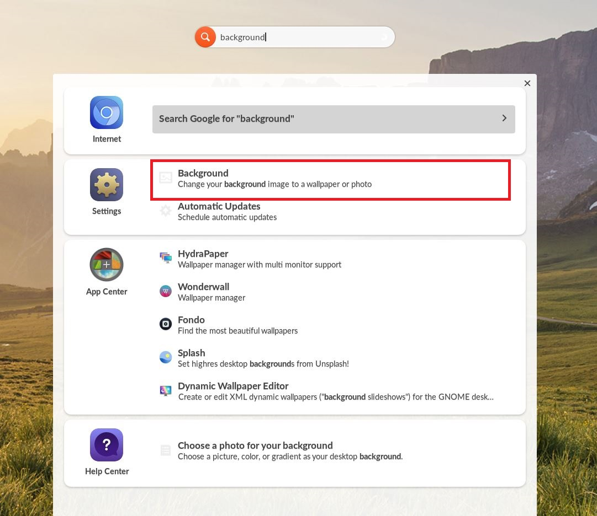
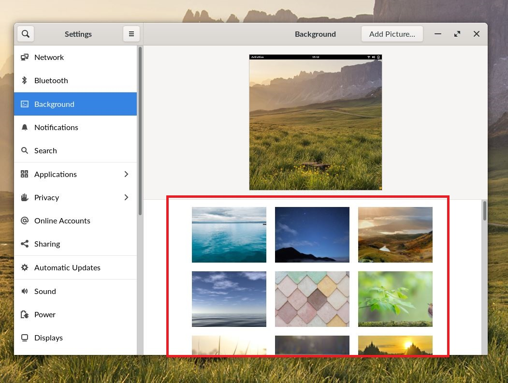

.. _changing_background:

Changing Background
###################

This guide will help you learn to change the background image of the Endless OS Desktop

*************
Prerequisites

To accomplish this task, you will need:

* WP Securebook

To change the image of the Endless OS Desktop background, follow these steps:

1. Login to the desired Endless OS account
2. Type "background" in the Universal Searchbar at the top of the desktop
3. Click Background in the Settings option

4. Scroll through the options and click an image to apply it to the Endless OS desktop

.. note::

    Custom Background images can be selected by clicking the "Add Picture..." button in to top right of the Background Settings Window
