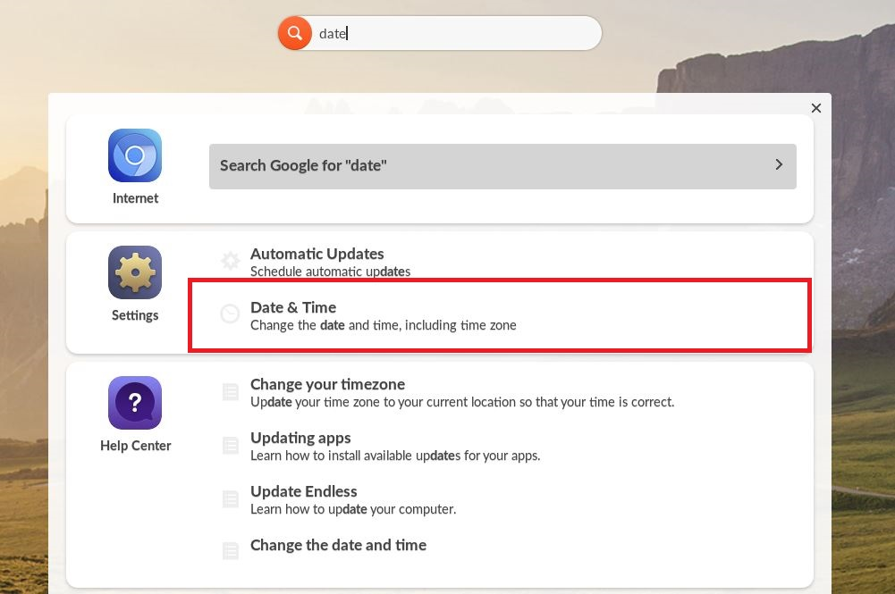
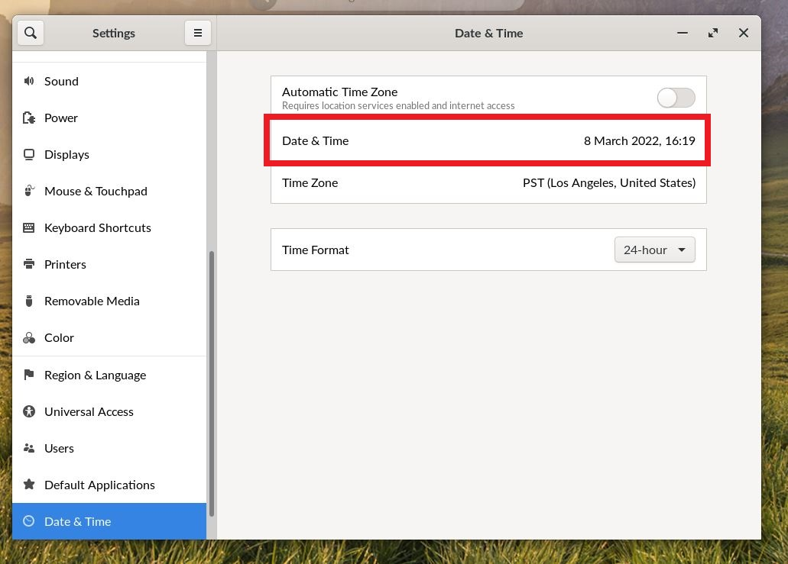
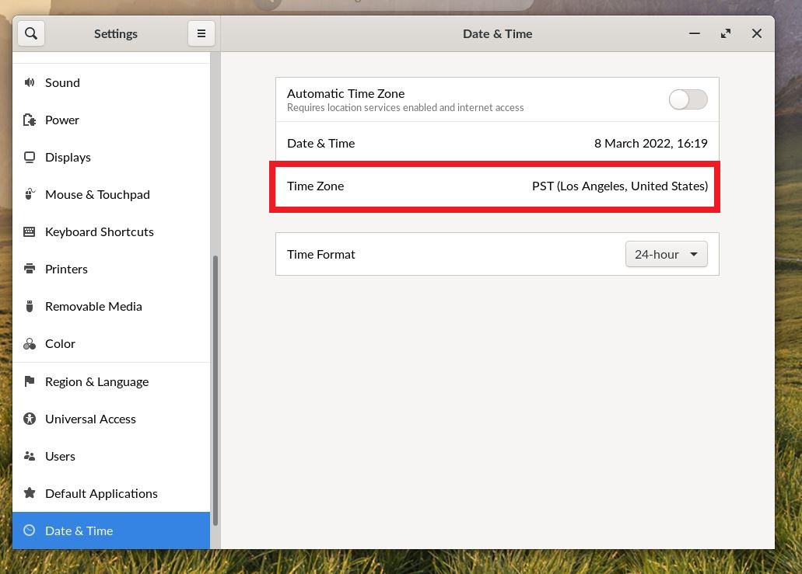
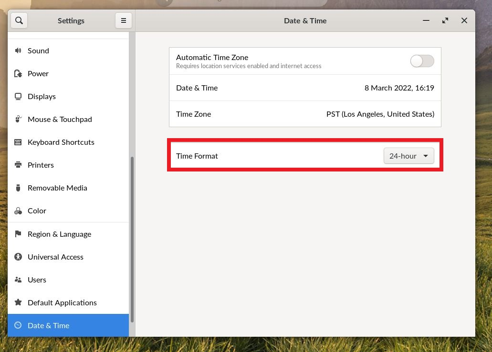

.. _changing_date_and_time:

Changing Date and Time
######################

This guide will help you learn to change the Endless OS Date & Time settings

*************
Prerequisites

To accomplish this task, you will need:

* WP Securebook

To change the Endless OS Date & Time settings, follow these steps:

1. Log into an Endless OS user account
2. Type "date" into the Universal Searchbar at the top of the desktop
3. Select Date & Time from the Settings option

4. Select the Date & Time option to change the local date and time

.. note::

    If this securebook connects to the internet or internet-bound server the date and time may automatically correct themselves to be concurrent with the date and time on that network.

5. Select the Time Zone option to change the local time zone

.. note::

    If this securebook connects to the internet or internet-bound server the time zone may automatically correct itself to be concurrent with the time zone on that network.
    
6. Select the Time Format option to change between the 24-hour format and the AM / PM format.

