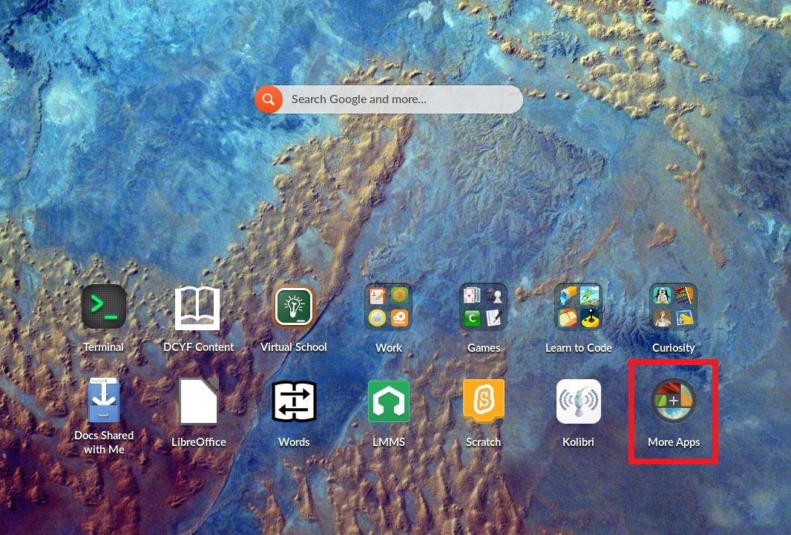
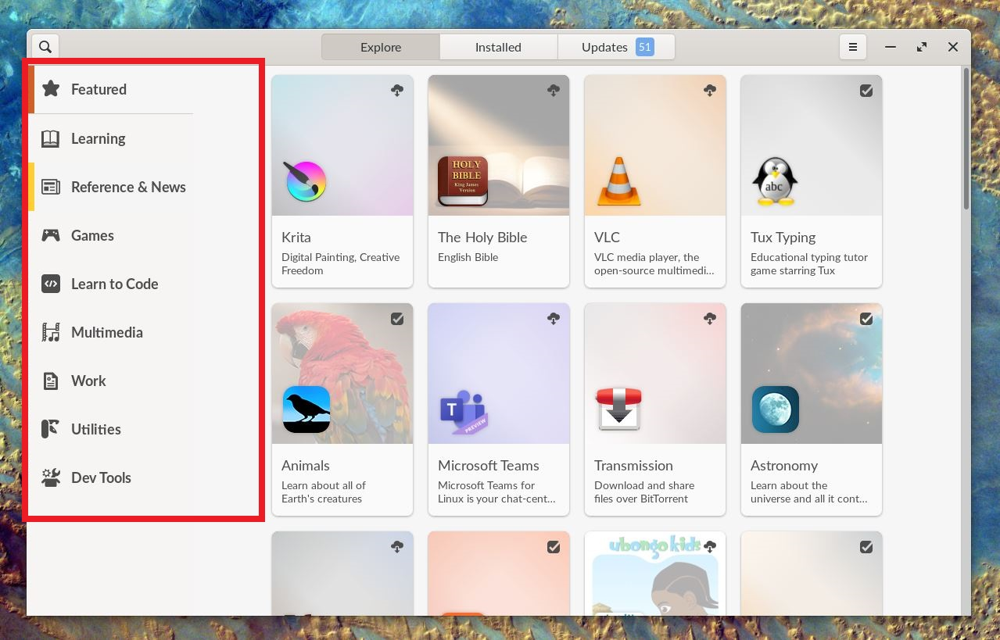
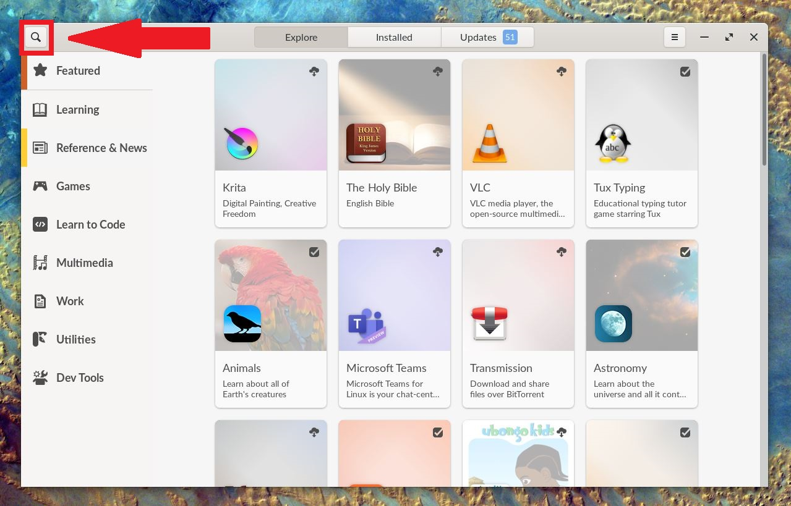
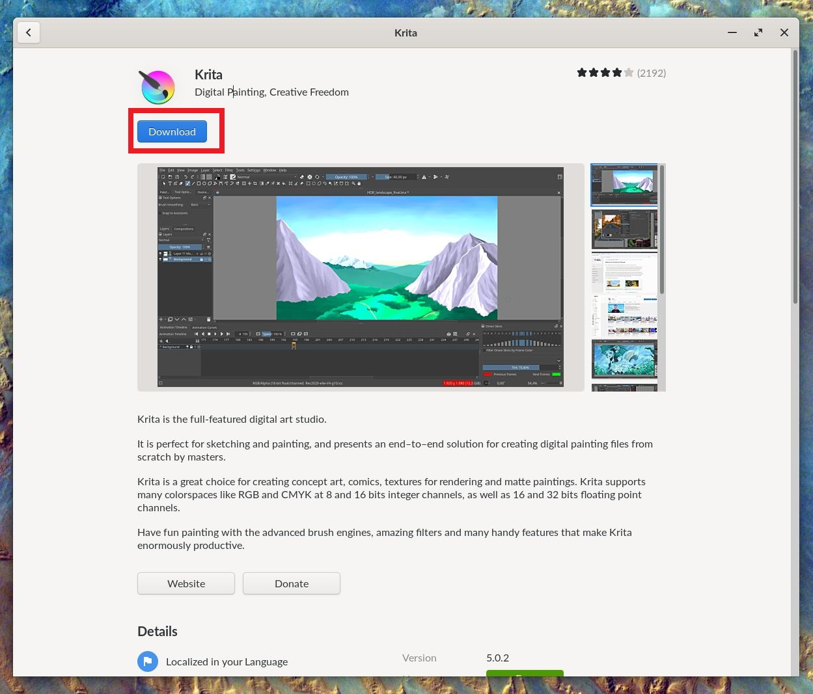
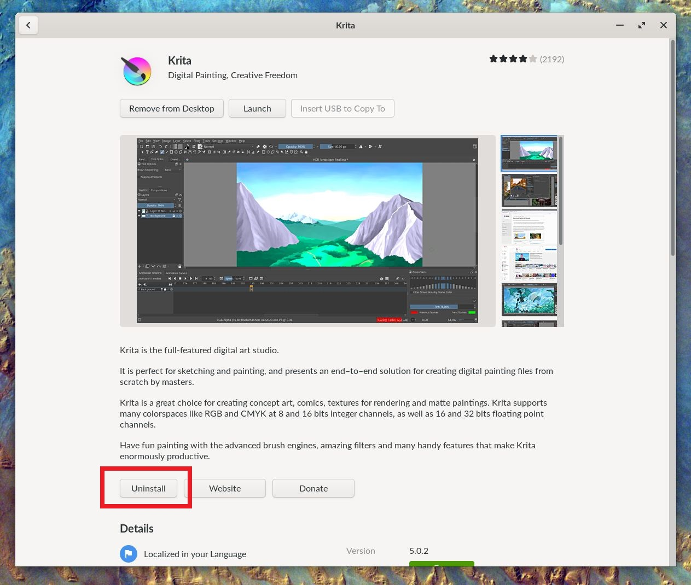
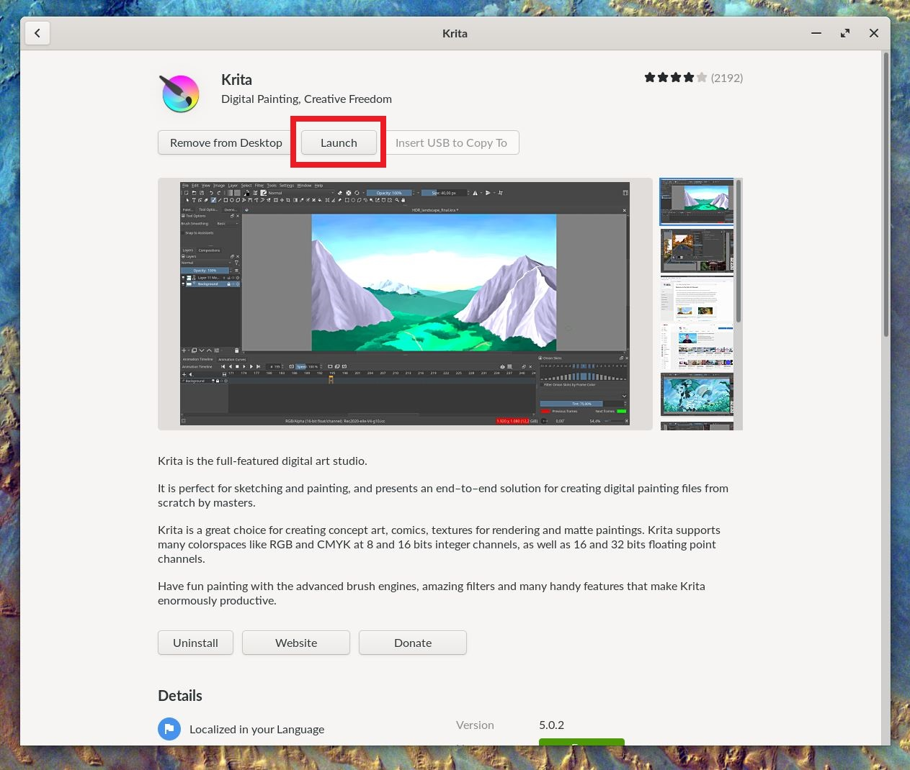

.. _installing_new_apps:

How to Install New Applications to EOS
######################################

This guide will help you learn to install new applications to the Endless OS Securebook

*************
Prerequisites

To accomplish this process, you will need:

* WP Securebook
* Red (Wi-Fi) Securebook Docking Station
* Wireless Internet Network

To install new applications to the EOS Securebook, follow these steps:

1. Turn off the Securebook
2. Dock the Securebook onto the Red Docking Station
3. Turn on the Securebook
4. Log in to the jadmin account
5. Select the "More Apps" Desktop Icon

6. When the app center opens, search for the application you need using the categories on the left sidebar

.. note:: 

    You can also try searching for the app by name with the search function, located by clicking the magnifying glass button in the very top left!

    
7. Click the "Download" button to install the application

.. note::

    Applications can similarly be uninstalled by clicking the "Uninstall" button between the Application's Description text and the Details

    
8. To launch the application, click the "Launch" button or Click the "Add to Desktop" button (if it isn't automatically added to desktop) and then select the application from the desktop

