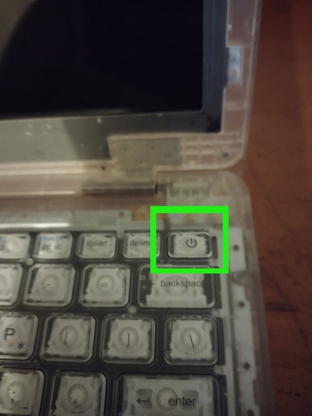
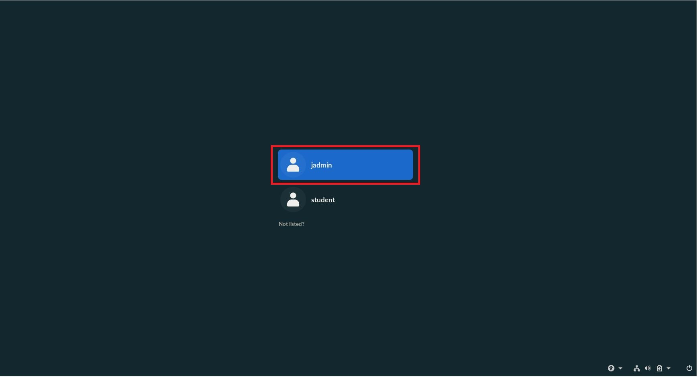
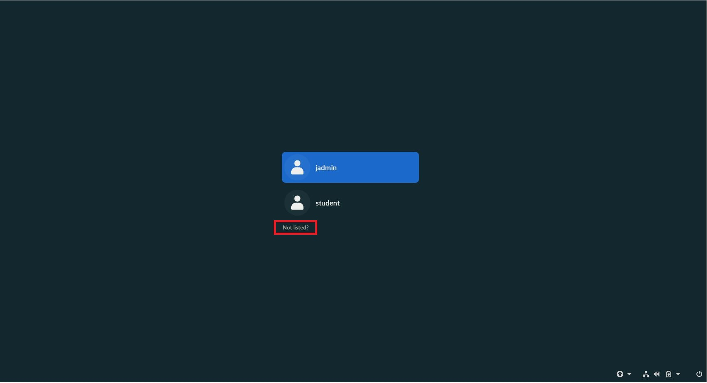
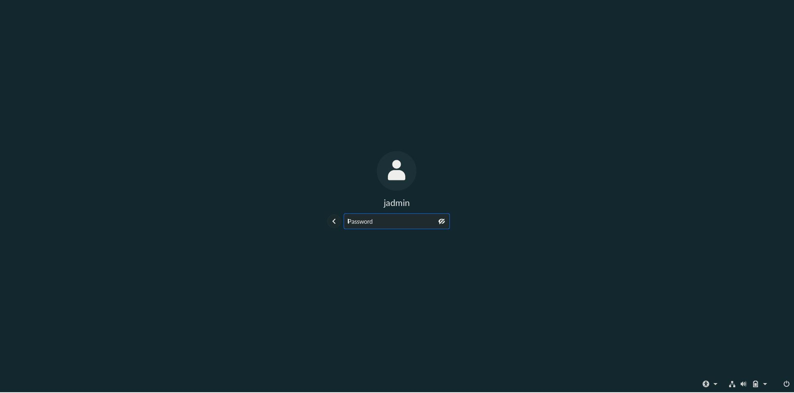
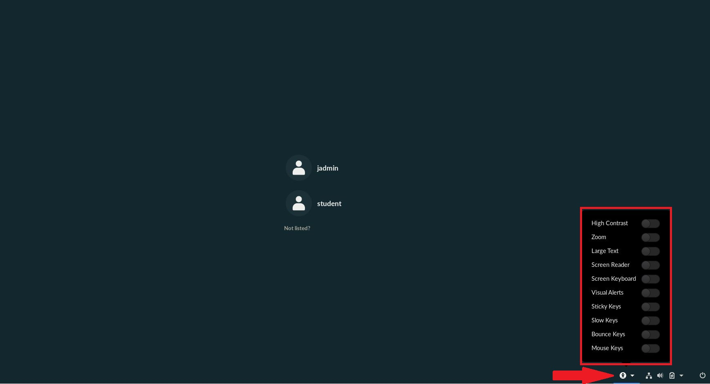

.. _logging_in:

Logging In
##########

This process will help you learn how to log into your Endless OS Account

*************
Prerequisites

To accomplish this task, you will need:

* WP Securebook
* Account Credentials

To Log in to an Endless OS User Account, follow these steps:

1. Turn the Securebook on.

2. When the Account Selection Screen appears, choose the account you wish to log into.

.. note::

    If the account you wish to log into isn't shown among the available account options, select the "Not Listed?" button and type the name of your account in manually.
    

3. Enter the password to the account.

.. note::

    If you are having troubles seeing/ reading the options or you need a keyboard substitute, click the Accessibility button in the bottom right of the Loggin Screen. This will give you a menu with a number of options and tools you can use to make your Endless OS experience easier.
    
