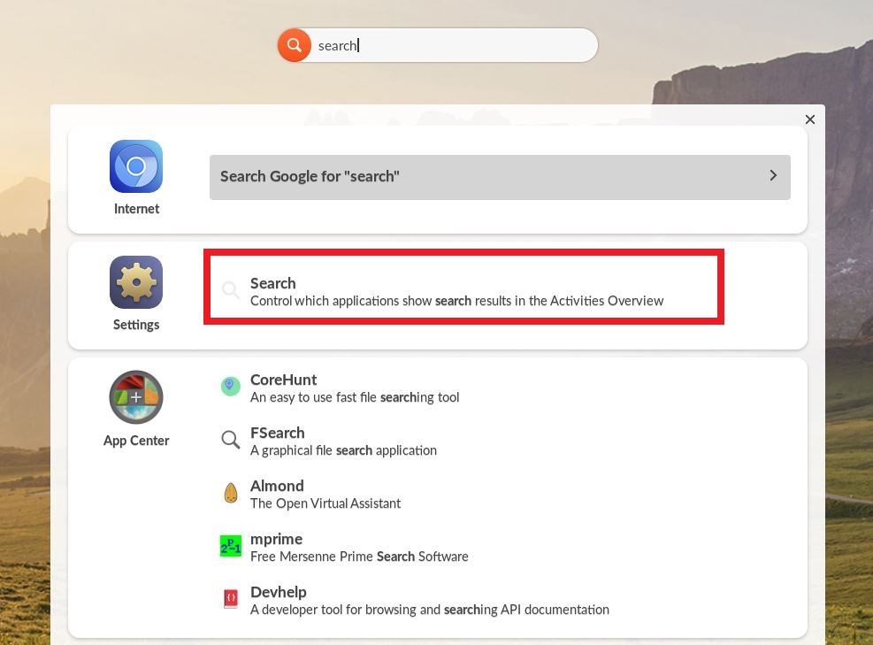
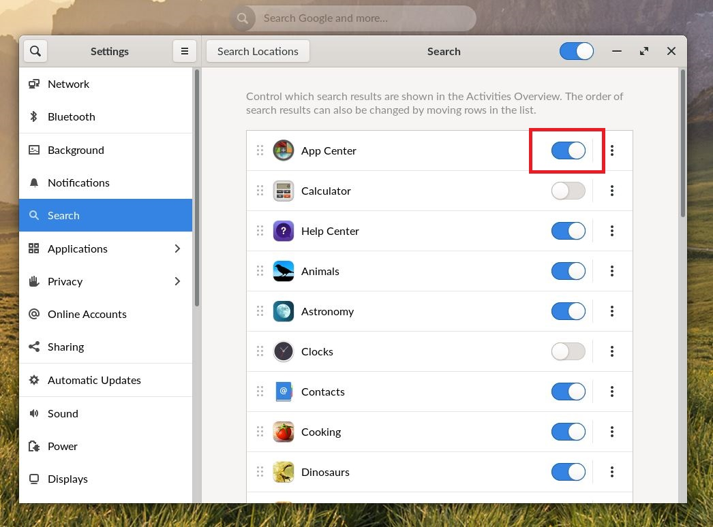

.. _managing_searchbar:

Managing Searchbar
##################

This guide will help you learn to explicitely manange the Universal Searchbar

*************
Prerequisites

To accomplish this task, you will need:

* WP Securebook

To manage the searchbar, follow these steps:

1. Log into an Endless OS user account
2. Type "Search" into the Universal Searchbar at the top of the desktop
3. Select Search from the Settings option

4. Scroll through the list of applications and system tools and toggle on any sources you wish to be included when searching using the Universal Searchbar. (Blue is on.)

.. note::

    Additionally, by clicking the three vertical dots on a resource you can move it up or down in the search importance. Apps closer to the top get searched before those at the bottom.
    
.. image:: ../_resource/SettingsUI_Search_moveResource.jpg