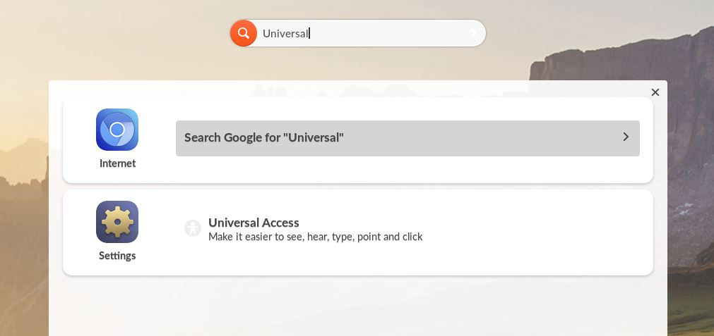

.. _managing_universal_access:

Managing Universal Access Tools
###############################

This guide will help you learn to access and use the Universal Access Tools

*************
Prerequisites

To accomplish this task, you will need:

* WP Securebook

To access and use the Universal Access tools, follow these steps:

1. Log into a Endless OS user account
2. Type "universal" into the Universal Searchbar at the top of the desktop
3. Select Universal Access in the Settings option

4. To always show the Universal Access Tools menu, toggle that option.

5. Scroll through the various Access Tool options and enable any that you would find useful in helping you use Endless OS to its fullest.

.. note:: 

    The Access Tools, when always show is enabled, can be selected by clicking the Universal Access Icon in the bottom right of the taskbar.

