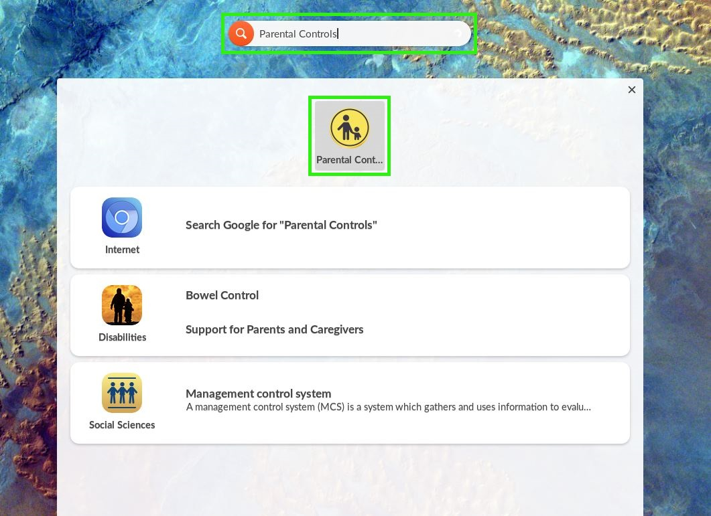
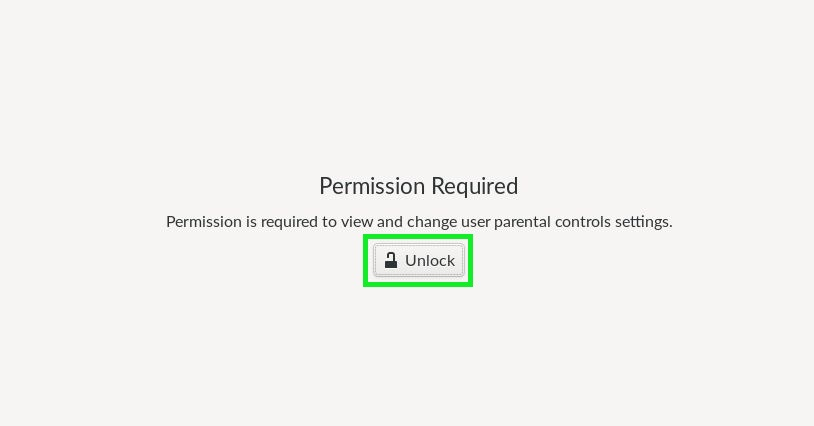
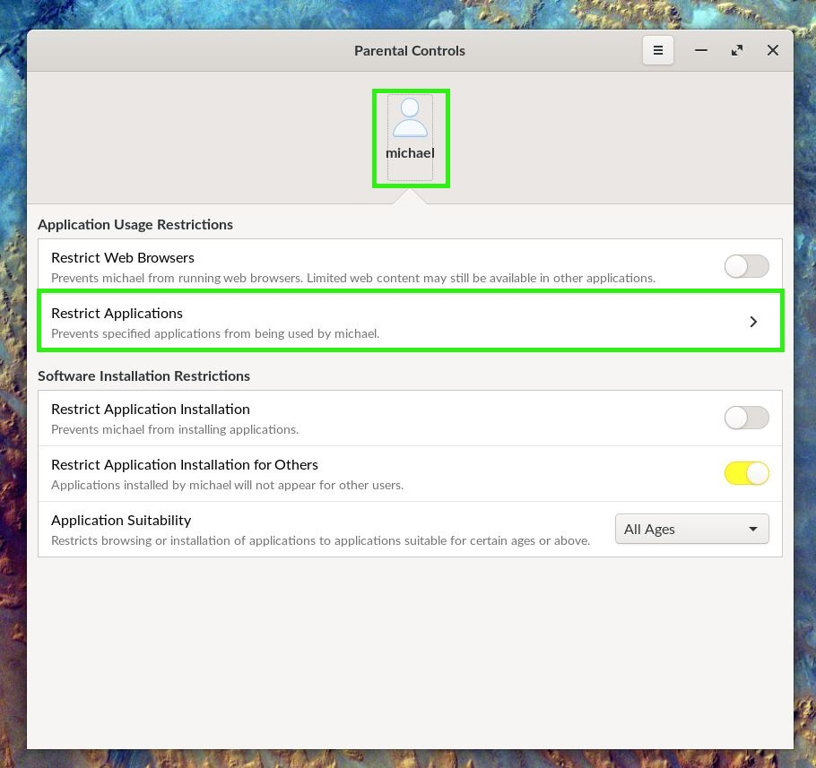
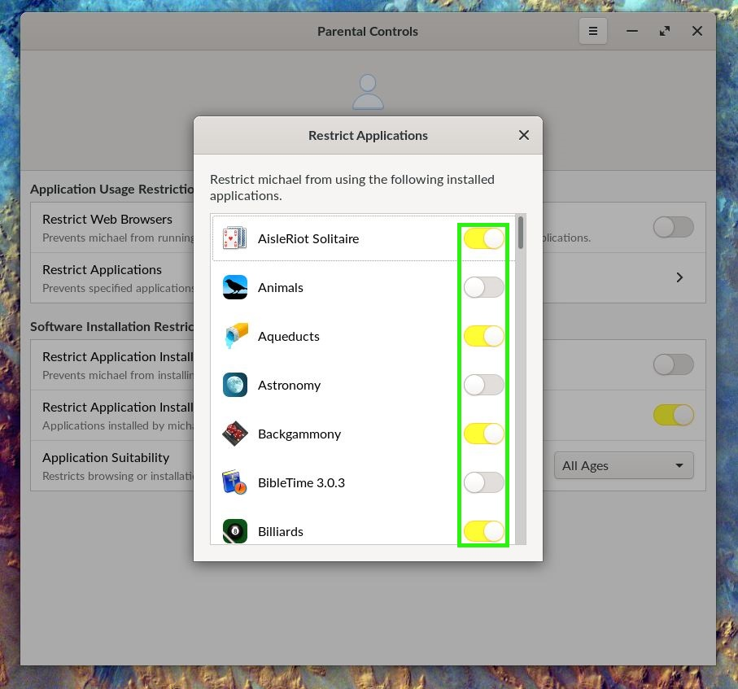

.. _parental_controls:

Setting Parental Controls
#########################

This guide will help you learn how to access the Parental Controls to restrict students from accessing choice applications

*************
Prerequisites

To accomplish this task, you will need:

* WP Securebook
* jadmin Credentials

To access the parental controls, follow these steps:

1. Log into the jadmin account
2. Type "Parental" into the Universal Searchbar at the top of the desktop
3. Select the Parental Controls icon

4. Select the "Unlock" button and enter your jadmin credentials into the window that pops up

5. Select the user whose applications you want to restrict and select the "Restrict Applications" button

6. Once the application list window pops up, scroll through and toggle all of the applications that you don't want this user to be able to access

.. note::

    Toggles that are yellow are applied, white toggles are not.

Once you are finished, simply close the window and close the Parental Controls Window. The settings are saved automatically.