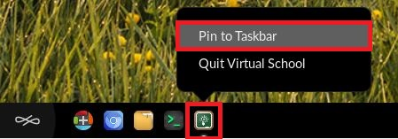

.. _pinning_apps_to_taskbar:

Pinning Apps to Taskbar
#######################

This guide will help you learn how to pin application icons to the taskbar for ease of access

*************
Prerequisites

To accomplish this task, you will need:

* WP Securebook

To pin apps to the taskbar, follow these steps:

1. Log into an Endless OS user account
2. Open an application or tool

3. Right click on the application icon on the taskbar
4. Select the "Pin to Taskbar" option

Now, the icon will remain on the taskbar even when the application is closed. To open the application again, simply click the icon on the taskbar.

.. note::

    Pinned icons can be removed by right clicking and selecting the "Unpin from Taskbar" option
    
