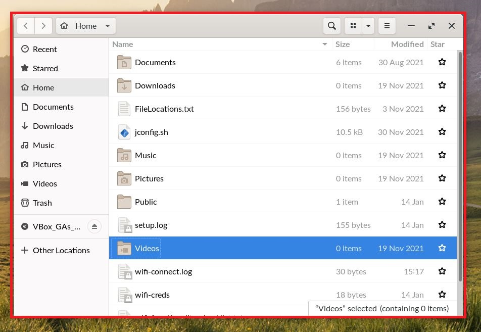
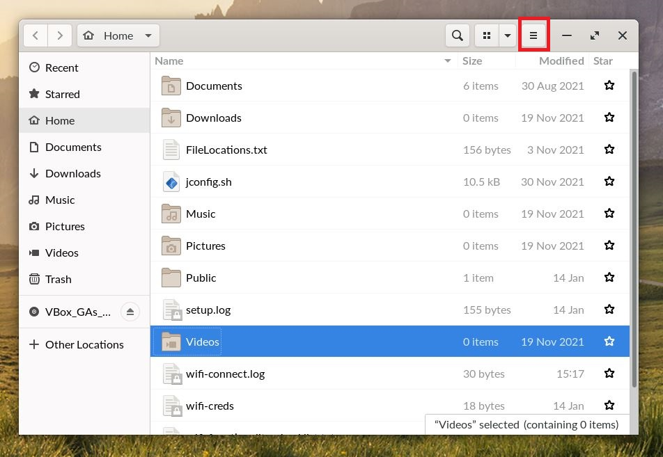
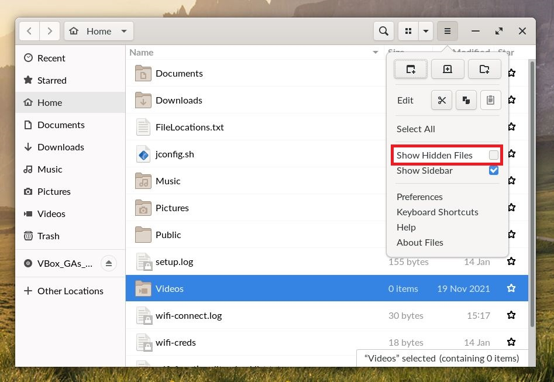
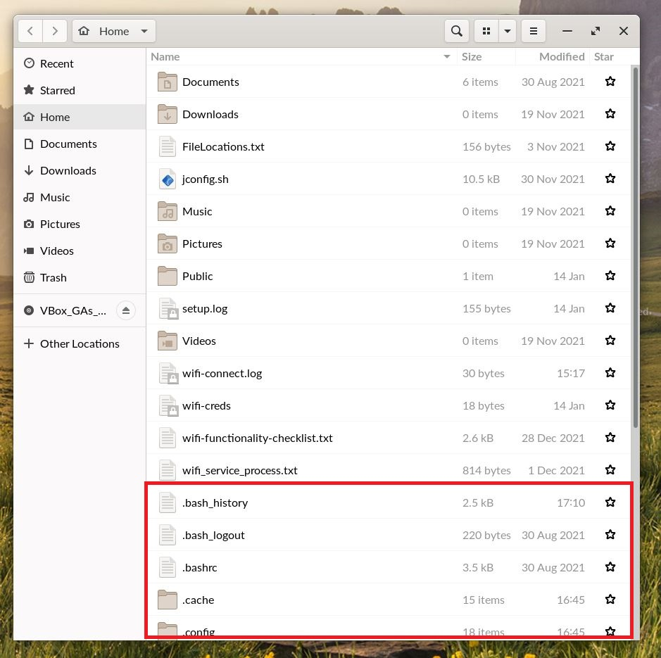

.. _viewing_hidden_files:

Viewing Hidden Files and Folders
################################

This guide will help you learn how to make hidden files and folders appear in the file explorer

*************
Prerequisites

To accomplish this task, you will need:

* WP Securebook

To display hidden files and folders, follow these steps:

1. Log into an Endless OS user Account
2. Open the file explorer

3. Click the button with the three horizontal lines in the top right of the file explorer

4. Check the box next to the words "Show Hidden Files"

5. Scroll down and (given that you are in the jadmin home folder, which you should be by default) you will see files and folders you wouldn't have seen before

.. note::

    To hide the hidden folders and files, simply uncheck that box we checked in step 4.