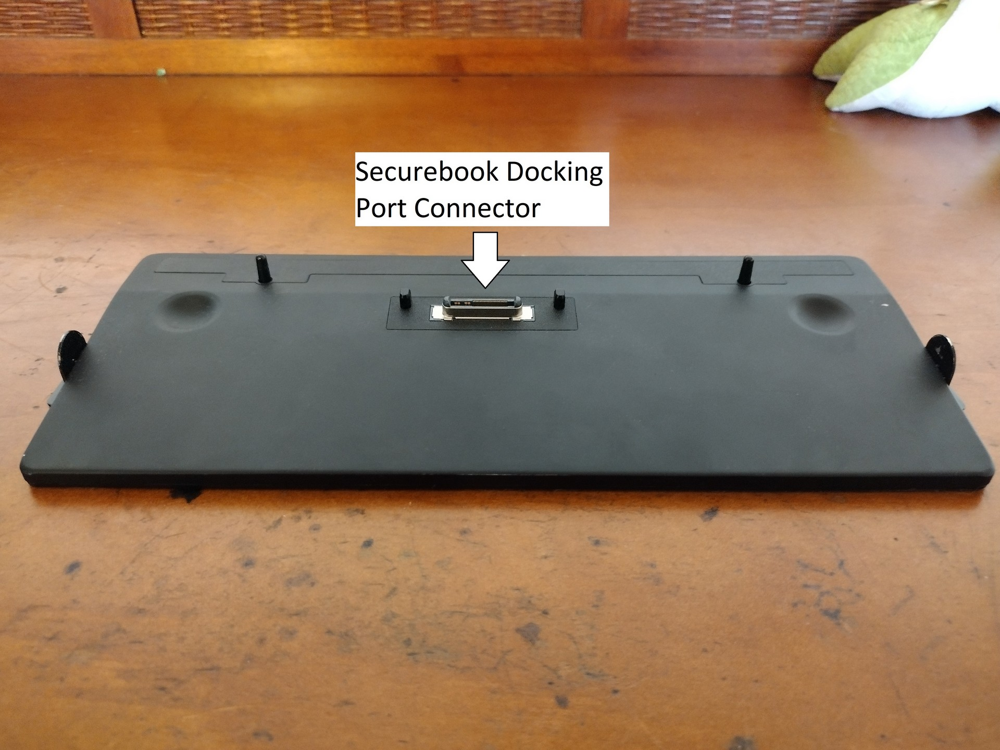
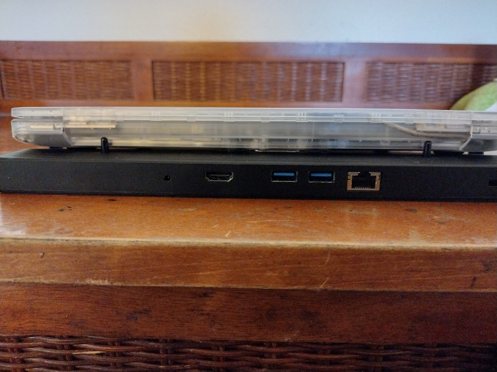
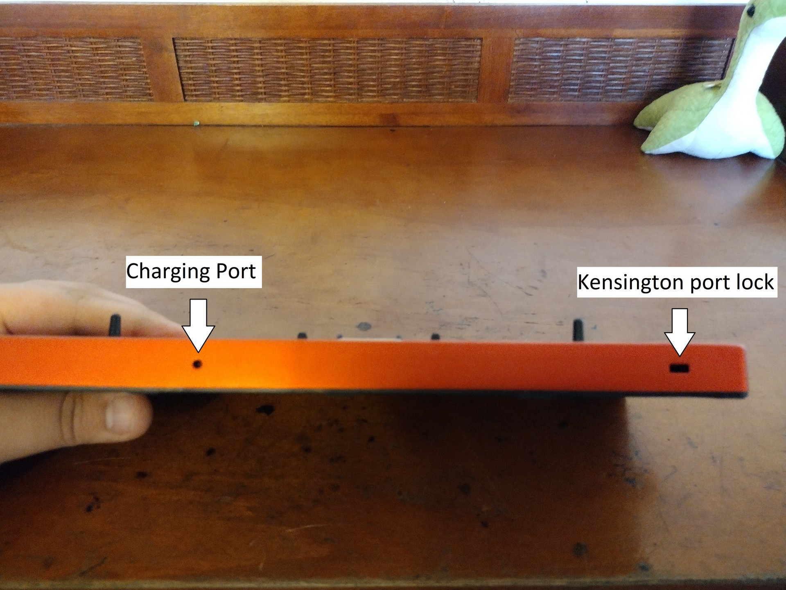
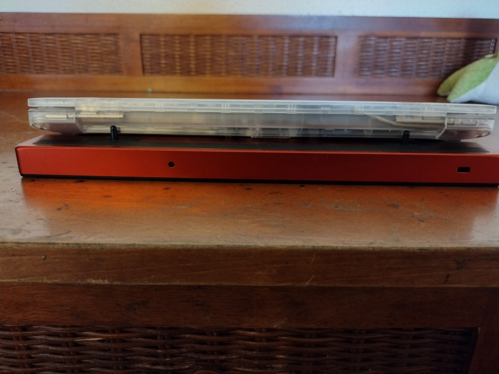
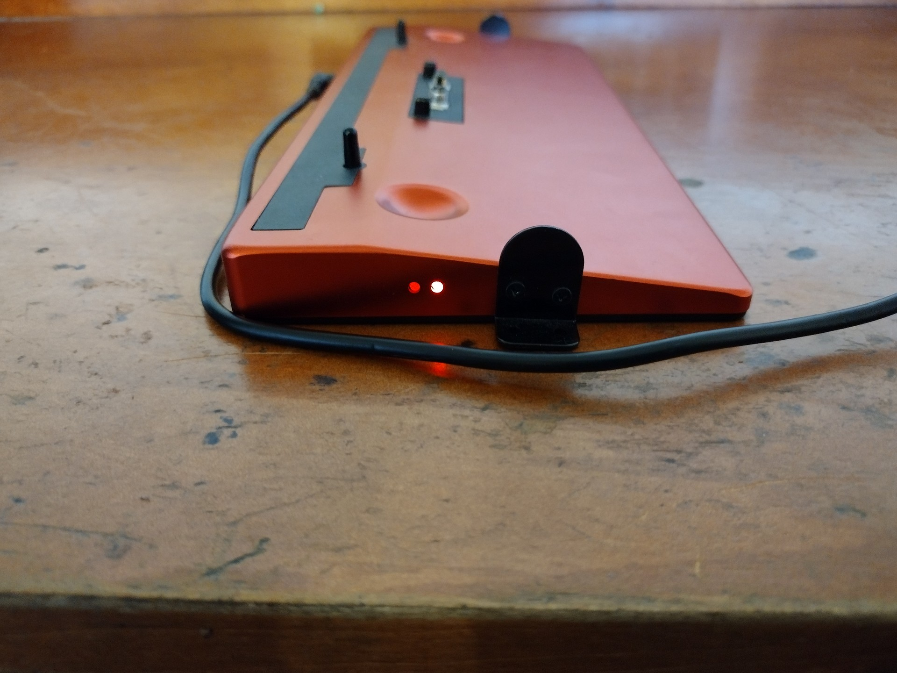

.. _hardware_overview:

Hardware Overview
#################

An overview of the different hardware components available

Prerequisites
=============
To accomplish this process, you will need:
- WP Securebook
- Docking Station (Red or Black)
- Securebook Charger

Docking Station Evaluation
==========================

This section will cover all of the ports and functions of both the Black (USB) Docking Station and the Red (Wi-Fi) Docking Station.

Black (USB) Docking Station
===========================

The USB Docking Station is for when you need to connect your Securebook to a USB, Ethernet, or HDMI connection. Additionally, the docking station has a charging port, perminant placement screw mounts, and a Kensington port lock. 

.. image:: ../_resources/USBDockPorts.jpg

.. image:: ../_resources/USBDockLights.jpg

.. note:: 

    When connecting to a Securebook, the securebook is placed snug against the dock with the dock's protruding connector securely placed inside the Securebook's docking port on the bottom.

.. note::    

    When a powered on securebook is properly docked, a green LED light will show on the side of the Docking Station.

.. image:: ../_resources/IMG_20220110_134437908_HDR.jpg

.. note::

    When a securebook is improperly docked or the Docking Station has the charger plugged into it without the securebook being docked, a red LED light will show on the side of the Docking Station.

.. image:: ../_resources/IMG_20220110_134843878_HDR.jpg

Red (Wi-Fi) Docking Station
===========================

The Wi-Fi Docking Station is for when you need to connect your Securebook to a wireless network. Additionally, the docking station has a charging port, perminant placement screw mounts, and a Kensington port lock.

.. image:: ../_resources/WIFIDockConnector.jpg

.. image:: ../_resources/WIFIDockLights.jpg

.. note::

    When connecting to a Securebook, the securebook is placed snug against the dock with the dock's protruding connector securely placed inside the Securebook's docking port on the bottom.

.. note::

    When a powered on securebook is properly docked, a green LED light will show on the side of the Docking Station.

.. image:: ../_resources/IMG_20220110_134612307_HDR.jpg

.. note::

    When a securebook is improperly docked or the Docking Station has the charger plugged into it without the securebook being docked, a red LED light will show on the side of the Docking Station.

