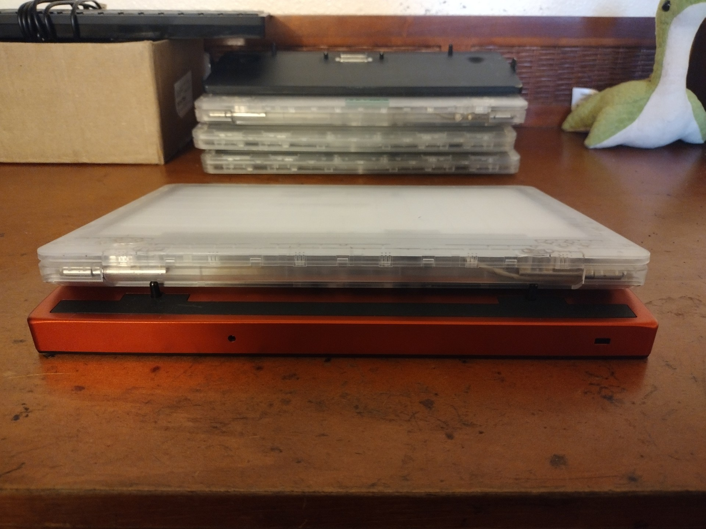

.. _how_to_dock_devices_to_wi-fi:

How to Dock Devices to Wi-Fi
############################

This guide will help you learn to connect a wireless network with a Securebook and Red Docking Station.

*************
Prerequisites
*************

To accomplish this process, you will need:

* WP Securebook
* Red (Wi-Fi) Securebook Docking Station

To connect the securebook to a wireless Wi-Fi network, follow these steps:

1. Power Off the Securebook
2. Dock the Securebook onto the Red Docking Station

.. note::

    If the Securebook is correctly situated on the docking station, A green light will light up on the side. If there is no light, the Securebook could be improperly mounted, powered off, or even be dead (0% power).

.. image:: ../_resources/IMG_20220110_134612307_HDR.jpg

3. Power On the Securebook
4. Log in to an account

.. note::

    The Endless OS Justice Michigan Image has the Wi-Fi connection to RACHEL preconfigured, meaning that no additional steps are need to access the RACHEL device, given that the Securebook is Docked and in range of the RACHEL device.
    Users are not limited to using a singular Red Docking Station. Should the need arise, the user can repeat the steps above on an entirely different Red Docking Station and achieve the same results.
    For best results, make sure the Securebook is Turned Off when docking to a Red Docking Station.