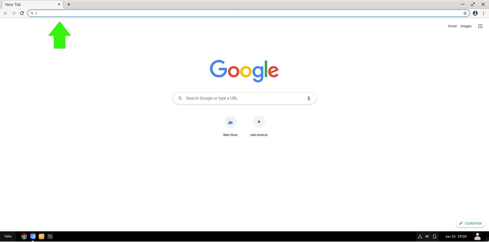

.. _check_browser:

Checking Browser History
########################

This guide will help the admin check the browser history of the student account.

Prerequisites
=============

To accomplish these processes, you will need:

* WP Securebook
* Student Credentials

Checking Browser History
========================

1. Power on the Securebook
2. Log into the Student account using the Student Credentials
3. Open the Web Broswer
4. Enter the following address into the address bar:
.. code-block::
    :linenos:

    chrome://history

.. note::

    In the center of the page, below the searchbar, is the history area that will display all of the student's browser history in chronological order, newest history being at the top.

.. image:: ../_resources/history.jpg

Here the student's Browser History can be viewed
Additionally, the searchbar at the top allows you to use keywords or website names to narrow your search through the saved history.

.. image:: ../_resources/SearchHistory.jpg